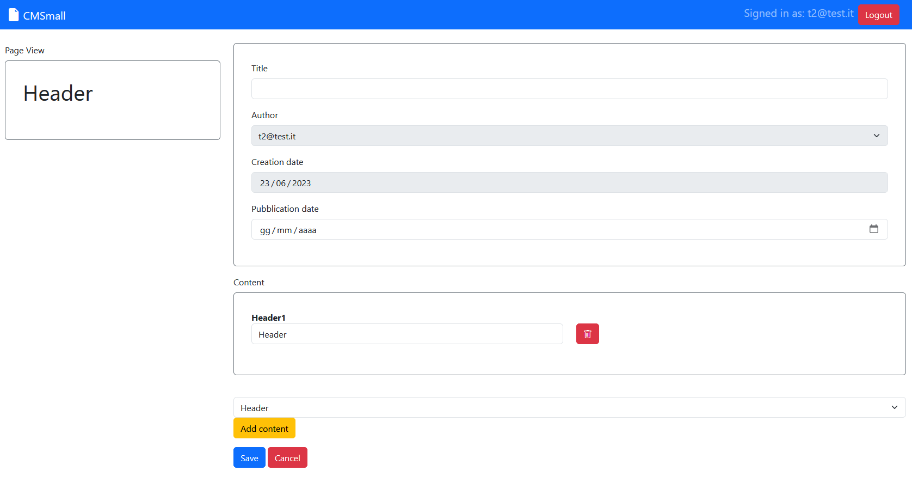
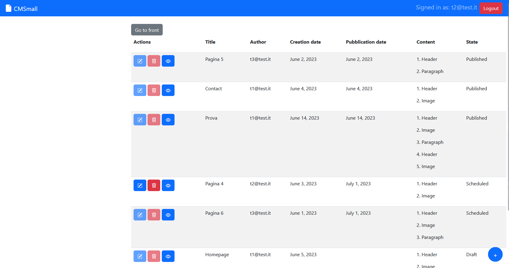

# Exam #1: "CMSmall"
## Student: s319870 Bisignano Angelo

## React Client Application Routes

- Route `/`: this route shows a table with the pages, thanks to a state can be set on front or back-office, the back-office is accessible only by logged users. In the first case, the user can only see the pubblicated pages, in the second case the user can also edit, add and delete the pages.
- Route `/login`: route to login by using credentials (email and password)
- Route `/add`: route for logged users to add a new page
- Route `/edit/:pageId`: route for logged users to edit an own page
- Route `/modify-name`: route to form to modify the name of the site, only for admin

## API Server

- GET `/api/pubPages`
  - (Not authenticated) Get all the pubblicated pages
  - Request body: none
  - Response: `200 OK` (success) or `500 Internal Server Error` (generic error)
  - Response body content: An array of objects, each describing a page
  ```
  [
    {
      "id": 2,
      "title": "Contact",
      "author": 1,
      "creationDate": "2023-06-04",
      "pubblicationDate": "2023-06-04",
      "content": [
        {
          "type": "Header",
          "name": "Header1",
          "value": "Contact"
        },
        {
          "type": "Image",
          "name": "Image2",
          "value": "img4.jpeg"
        }
      ]
    },
    ...
  ]
  ```
- GET `/api/pages`
  - (Authenticated) Get all the pages
  - Request body: none
  - Response: `200 OK` (success), `401 Unauthorized` (not authorized), `304 Not Modified` or `500 Internal Server Error` (generic error)
  - Response body content: An array of objects, each describing a page
  ```
  [
    {
      "id": 1,
      "title": "Homepage",
      "author": 1,
      "creationDate": "2023-06-05",
      "pubblicationDate": null,
      "content": [
        {
          "type": "Header",
          "name": "Header1",
          "value": "Homepageheader"
        },
        {
          "type": "Image",
          "name": "Image2",
          "value": "img4.jpeg"
        },
        {
          "type": "Image",
          "name": "Image3",
          "value": "img2.jpeg"
        }
      ]
    },
    ...
  ]
  ```
- GET `/api/pages/<id>`
  - (Authenticated internally if the page is not pubblicated) Get the page with the given `<id>` (if exists)
  - Request body: none
  - Response: `200 OK` (success), `404 Not Found` (wrong id), `401 Unauthorized` (not authorized) or `500 Internal Server Error` (generic error)
  - Response body content: An object describing a singol page
  ```
  {
    "id": 1,
    "title": "Homepage",
    "author": 1,
    "creationDate": "2023-06-05",
    "pubblicationDate": null,
    "content": [
      {
        "type": "Header",
        "name": "Header1",
        "value": "Homepageheader"
      },
      {
        "type": "Image",
        "name": "Image2",
        "value": "img4.jpeg"
      },
      {
        "type": "Image",
        "name": "Image3",
        "value": "img2.jpeg"
      }
    ]
  }
  ```
- POST `/api/pages`
  - (Authenticated) Add a new page
  - Request body: An object describing a new page (Content-Type: `application/json`).
  ```
  {
    "title": "Test",
    "author": 1,
    "creationDate": "2023-06-05",
    "pubblicationDate": null,
    "content": [
      {
        "type": "Header",
        "name": "Header1",
        "value": "Homepageheader"
      },
      {
        "type": "Image",
        "name": "Image2",
        "value": "img4.jpeg"
      },
      {
        "type": "Image",
        "name": "Image3",
        "value": "img2.jpeg"
      }
    ]
  }
  ```
  - Response: `201 Created` (success), `503 Service Unavailable` (generic error). If the user request body is not valid, `422 Unprocessable Entity` (validation error)
  - Response body:
  ```
  {
    "id": 38,
    "title": "Test",
    "author": 1,
    "creationDate": "2023-06-05",
    "pubblicationDate": null,
    "content": [
      {
        "type": "Header",
        "name": "Header1",
        "value": "Homepageheader"
      },
      {
        "type": "Image",
        "name": "Image2",
        "value": "img4.jpeg"
      },
      {
        "type": "Image",
        "name": "Image3",
        "value": "img2.jpeg"
      }
    ]
  }
  ```
- PUT `/api/pages/<id>`
  - (Authenticated) Update entirely an existing answer, given its `<id>`
  - Request body: An object describing a new page (Content-Type: `application/json`).
  ```
  {
    "id": 38,
    "title": "Test",
    "author": 1,
    "creationDate": "2023-06-05",
    "pubblicationDate": "",
    "content": [
      {
        "type": "Header",
        "name": "Header1",
        "value": "Homepageheader"
      },
      {
        "type": "Image",
        "name": "Image2",
        "value": "img4.jpeg"
      },
      {
        "type": "Image",
        "name": "Image3",
        "value": "img2.jpeg"
      }
    ]
  }
  ```
  - Response: `200 OK` (success), `404 Not Found` (wrong id) or `503 Service Unavailable` (generic error). If the user request body is not valid, `422 Unprocessable Entity` (validation error). If the user is not the author of the page, `401 Unauthorized` (not authorized)
  - Response body:
  ```
  {
    "id": 38,
    "title": "Test modificato",
    "author": 1,
    "creationDate": "2023-06-05",
    "pubblicationDate": "",
    "content": [
      {
        "type": "Header",
        "name": "Header1",
        "value": "Homepageheader"
      },
      {
        "type": "Image",
        "name": "Image2",
        "value": "img4.jpeg"
      },
      {
        "type": "Image",
        "name": "Image3",
        "value": "img2.jpeg"
      }
    ]
  }
  ```
- DELETE `/api/pages/<id>`
  - (Authenticated) Delete the page with the given `<id>` (if exists)
  - Request body: none
  - Response: `200 OK` (success), `404 Not Found` (wrong id) or `503 Service Unavailable` (generic error). If the user is not the author of the page, `401 Unauthorized` (not authorized)
  - Response body: none
- GET `/api/get-name`
  - (Not authenticated) Get the name of the site
  - Request body: none
  - Response: `200 OK` (success), `404 Not Found` or `500 Internal Server Error` (generic error)
  - Response body content: An object describing the name of the site
  ```
  "CMSmall"
  ```
- PUT `/api/modify-name/<name>`
  - (Authenticated) Modify the name of the user
  - Request body: none
  - Response: `200 OK` (success), `401 Unauthorized` (not authorized), `503 Service Unavailable` (generic error)
  - Response body: An object describing the new name of the site
  ```
  "NuovoNome"
  ```
- GET `/api/images`
  - (Not authenticated) Get all the images stored in the server
  - Request body: none
  - Response: `200 OK` (success) or `500 Internal Server Error` (generic error)
  - Response body content: An array of objects, each describing an image, with only `value`
  ```
  [
    {
      "value": "img1.jpeg"
    },
    {
      "value": "img2.jpeg"
    },
    {
      "value": "img3.jpeg"
    },
    {
      "value": "img4.jpeg"
    }
  ]
  ```
- GET `/api/users`
  - (Not authenticated) Get all the users email and id
  - Request body: none
  - Response: `200 OK` (success), `304 Not Modified` or `500 Internal Server Error` (generic error)
  - Response body content: An array of objects, each describing a user, with only `email` and `id`
  ```
  [
    {
      "id": 1,
      "email": "t1@test.it"
    },
    {
      "id": 2,
      "email": "t2@test.it"
    },
    {
      "id": 3,
      "email": "t3@test.it"
    },
    {
      "id": 4,
      "email": "t4@test.it"
    }
  ]
  ```
- POST `/api/sessions`
  - Login
  - Request body: An object describing an user (Content-Type: `application/json`).
  ```
  {
    "username": "t1@test.it",
    "password": "pass"
  }
  ```
  - Response: `200 OK` (success), `401 Unauthorized` (wrong credentials) or `503 Service Unavailable` (generic error)
  - Response body:
  ```
  {
    "id": 1,
    "username": "t1@test.it",
    "name": "t1",
    "amministratore": true
  }
  ```
- GET `/api/sessions/current`
  - (Not authenticated) Get info about the logged user
  - Request body: none
  - Response: `200 OK` (success), `401 Unauthorized` (not logged in) or `503 Service Unavailable` (generic error)
- DELETE `/api/sessions/current`
  - Logout
  - Request body: none
  - Response: `200 OK` (success), `503 Service Unavailable` (generic error)


## Database Tables

- Table `pages` - contains `id`, `title`, `author`, `creationDate`, `pubblicationDate`, `content` columns. The `content` column is a JSON object containing the type and the value of the content of the page
- Table `users` - contains `id`, `email`, `name`, `salt`, `hash`, `amministratore` columns
- Table `sitename` - contains `id`, `type`, `name` columns
- Table `images` - contains `id`, `value` columns

## Main React Components

- `Navigation` (in `Navigation.jsx`): component containing the navigation bar
- `DefaultLayout` (in `PageLayout.jsx`): component containing the layout of the page, is the default layout
- `PageInfo` (in `PageInfo.jsx`): component containing the info of the page that is visualized in the left column of the page, is not possible to modify the info of the page from here
- `MainLayout` (in `PageLayout.jsx`): component containing the table of the pages and the info of the page, could be set in front-office or in back-office
- `PagesTable` (in `PagesTable.jsx`): component containing the table of the pages, if in front-office only the pages pubblicated are visualized, if in back-office all the pages are visualized and is possible to modify them
- `AddLayout` (in `PageLayout.jsx`): component containing the form to create a new page
- `EditLayout` (in `PageLayout.jsx`): component containing the form to modify a page
- `LoginLayout` (in `PageLayout.jsx`): component containing the login form
- `PageForm` (in `PageForm.jsx`): component containing the form to create or modify a page
- `ModifyLayout` (in `PageLayout.jsx`): component containing the form to modify the name of the site
- `LoadingLayout` (in `PageLayout.jsx`): component containing the loading animation

## Screenshot




## Users Credentials

| id |      email        |  name   | password    | Description        |
| -- | ----------------- | ------- | ----------- | -------------------|
|  1 | t1@test.it        | t1      |  pass       | Admin              |
|  2 | t2@test.it        | t2      |  pass       | User with 2 pages  |
|  3 | t3@test.it        | t3      |  pass       | User with 2 pages  |
|  4 | t4@test.it        | t4      |  pass       | User with no pages |
